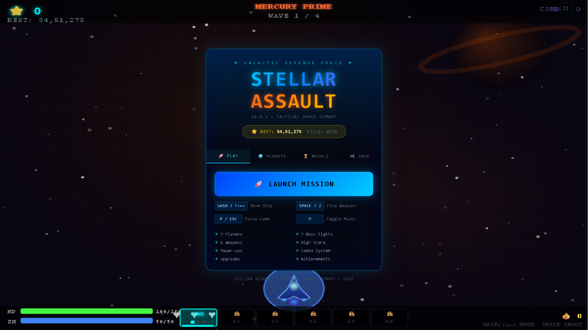
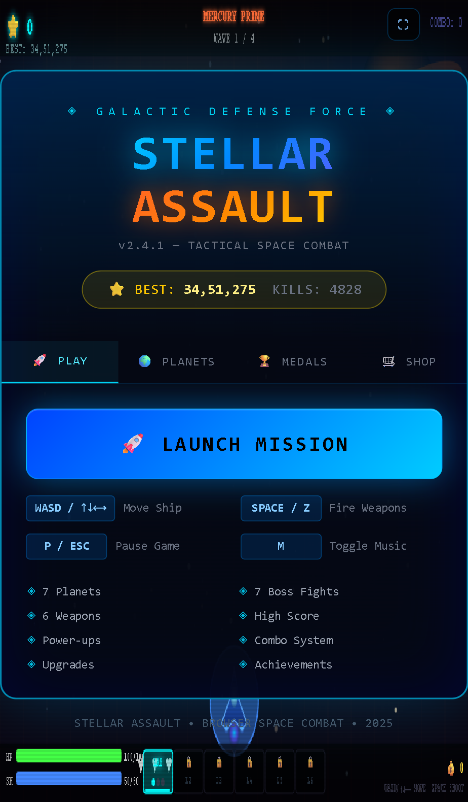
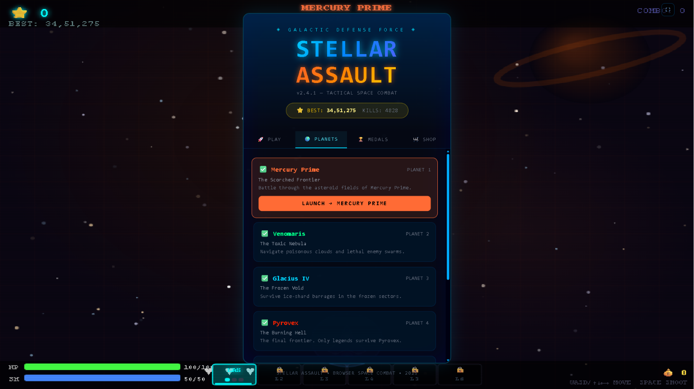
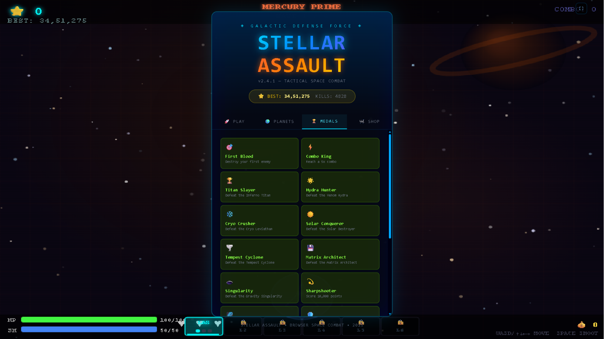
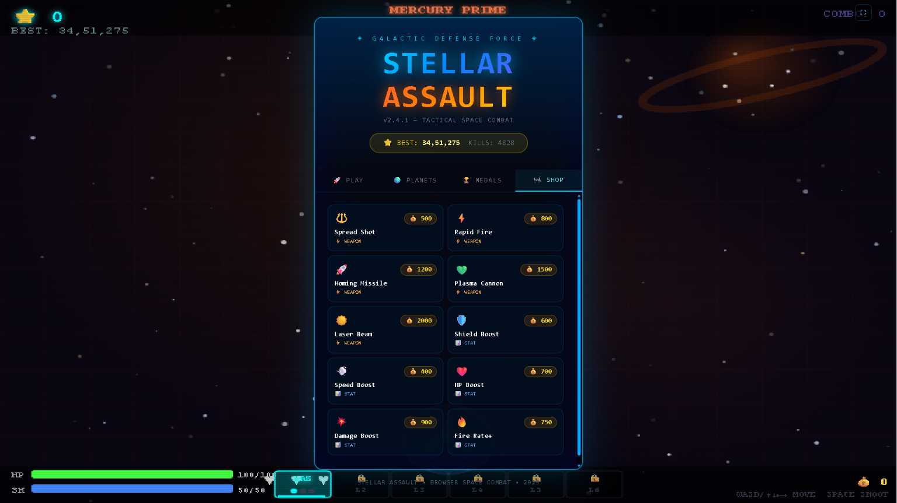
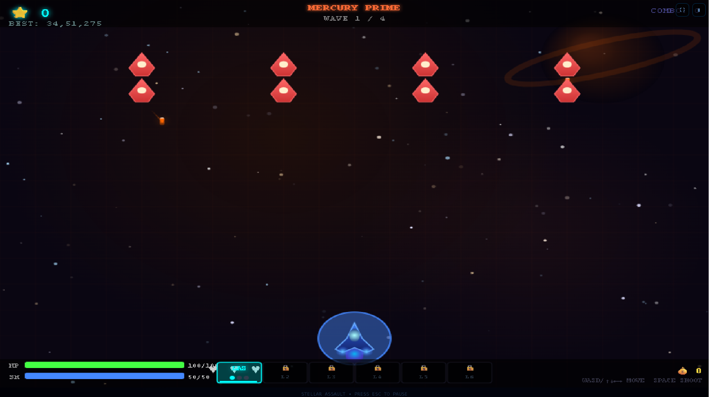

# 🚀 Stellar Assault — Space Shooter

> **Galactic Defense Force** | v2.4.1 — Tactical Space Combat

Stellar Assault is a futuristic, browser-based space shooter game built using **React**, **TypeScript**, **Vite**, and **TailwindCSS**. The game features fast-paced combat, progressive weapon upgrades, achievements, planet progression, and challenging boss battles — all running smoothly right in your browser with zero installs.

---

## 📸 Screenshots

### 1. 🚀 Main Menu — Play Tab (Full Screen)

> The main menu of Stellar Assault displayed in full-screen mode. Features the iconic **STELLAR ASSAULT** title with glowing cyan and orange typography, your all-time **Best Score** and **Kill Count**, and four navigation tabs: *Play*, *Planets*, *Medals*, and *Shop*. The glowing **"🚀 LAUNCH MISSION"** button sits front and center, ready to drop you straight into combat. Below it, all essential keybindings are listed — WASD for movement, Space/Z to fire weapons, P/ESC to pause, and M to toggle music. The animated starfield and ship visible in the background set the tone perfectly.

---

### 2. 🖥️ Main Menu — Play Tab (Compact View)

> The same Play tab rendered in a narrower viewport, demonstrating the game's **responsive UI layout**. The menu panel neatly adapts without losing any information — the launch button, controls reference, and feature highlights (7 Planets, 6 Weapons, Power-ups, Combo System, Achievements) remain fully accessible. A partial view of the animated space background peeks behind the panel. The HUD elements — HP bar, Shield bar, and weapon slots — are also visible along the bottom edge of the screen.

---

### 3. 🌍 Planets Tab — Mission Selection

> The **Planets** navigation tab showcasing the full galactic campaign map. Each planet entry displays its name, subtitle, and a lore-flavored description of the combat challenge waiting there:
> - 🟢 **Mercury Prime** *(Planet 1 — The Scorched Frontier)*: Battle through the asteroid fields of Mercury Prime.
> - 🟢 **Venomaris** *(Planet 2 — The Toxic Nebula)*: Navigate poisonous clouds and lethal enemy swarms.
> - 🟢 **Glacius IV** *(Planet 3 — The Frozen Void)*: Survive ice-shard barrages in the frozen sectors.
> - 🟢 **Pyrovex** *(Planet 4 — The Burning Hell)*: The final frontier. Only legends survive Pyrovex.
> - 🟢 **Aetherius** *(Planet 5 — The Tempest Giant)*: Battle through strong atmospheric winds on Aetherius.
> - 🟢 **Cybertron Core** *(Planet 6 — The Neon Grid)*: Hack through neon security defenses inside Cybertron Core.
> - 🟢 **Void Terminus** *(Planet 7 — The Gravity Well)*: Fight gravity pulls in the final sector of Void Terminus.

---

### 4. 🏆 Medals Tab — Achievements Gallery

> The **Medals** tab displaying the complete achievement gallery in a two-column grid layout. Each medal card shows a unique icon, title, and unlock condition:
> - 🎯 **First Blood** — Destroy your first enemy
> - ⚡ **Combo King** — Reach a 5x combo
> - 🏆 **Titan Slayer** — Defeat the Inferno Titan
> - 🌊 **Hydra Hunter** — Defeat the Venom Hydra
> - ❄️ **Cryo Crusher** — Defeat the Cryo Leviathan
> - ☀️ **Solar Conqueror** — Defeat the Solar Destroyer
> - 🌀 **Tempest Cyclone** — Defeat the Tempest Cyclone
> - 🖥️ **Matrix Architect** — Defeat the Matrix Architect
> - 🌑 **Singularity** — Defeat the Gravity Singularity
> - 🎯 **Sharpshooter** — Score 10,000 points
> - 🌌 **Space Legend** — Score 50,000 points
> - 🛡️ **Untouchable** — Complete a wave without damage
> - ⏱️ **Survivor** — Survive 5 minutes
> - ⚡ **Combo Legend** — Reach and hold an 8x combo
> - ☮️ **Pacifist** — Clear a wave without firing
> - ⏱️ **Speedrunner** — Defeat a boss in under 45s
> - 🤠 **Gunslinger** — Defeat a boss with starter laser
> - ⏳ **Elite Survivor** — Survive 10 minutes
>
> Medals serve as long-term goals tracking boss kills, score milestones, survival challenges, and special combat feats throughout the campaign.

---

### 5. 🛒 Shop Tab — Weapons & Upgrades Store

> The **Shop** tab where players spend credits earned during missions to permanently unlock and upgrade their arsenal and stats. Items are laid out in a clean two-column grid with gold coin cost displayed on each card:
>
> **Weapons (🔫 WEAPON):**
> | Item | Cost | Description |
> |------|------|-------------|
> | Spread Shot | 🪙 500 | Triple-projectile wide coverage |
> | Rapid Fire | 🪙 800 | High fire-rate barrage |
> | Homing Missile | 🪙 1200 | Heavy damage seeking missiles |
> | Plasma Cannon | 🪙 1500 | Explosive energy orbs |
> | Laser Beam | 🪙 2000 | Continuous charging laser beam |
>
> **Stat Boosts (📊 STAT):**
> | Item | Cost | Description |
> |------|------|-------------|
> | Shield Boost | 🪙 600 | Increases shield capacity |
> | Speed Boost | 🪙 400 | Increases movement speed |
> | HP Boost | 🪙 700 | Increases max health points |
> | Damage Boost | 🪙 900 | Increases weapon damage output |
> | Fire Rate+ | 🪙 750 | Increases firing speed |

---

### 6. 🎮 Gameplay — Level 1: Mercury Prime (Wave 1/4)

> **Live in-game action** on Planet 1 — Mercury Prime, Wave 1 of 4. The player's ship (glowing cyan triangle at the bottom center) holds position as the first wave of enemy ships descends from the top. The enemies are rendered as vivid red diamond-shaped crafts in a staggered formation. The warm amber-toned starfield and the ringed planet in the top-right corner establish the scorched frontier atmosphere of Mercury Prime.
>
> The HUD visible at the bottom includes:
> - 💚 **HP Bar** — 100/100 (full health)
> - 🔵 **Shield Bar** — 50/50 (full shields)
> - 🔫 **Weapon Slots** — L1 active (equipped), L2–L6 locked
> - ⭐ **Score** and **Combo** counter in the top corners
> - 📍 **Wave Indicator** — Wave 1 / 4 shown at top center

---

## 🎮 Controls & Keybindings

### Flight & Movement
- **`W` / `Arrow Up`**: Fly up
- **`A` / `Arrow Left`**: Move left
- **`S` / `Arrow Down`**: Move down
- **`D` / `Arrow Right`**: Move right
*(Supports smooth diagonal movement)*

### Weapons & Combat
- **`Space` / `Z` / `Enter`**: Fire equipped weapon
- **`1`**: Equip **Standard Laser** (fast and accurate)
- **`2`**: Equip **Spread Shot** (triple-projectile coverage)
- **`3`**: Equip **Rapid Fire** (high fire-rate barrage)
- **`4`**: Equip **Homing Missile** (heavy damage seeking missiles)
- **`5`**: Equip **Plasma Cannon** (explosive energy orbs)
- **`6`**: Equip **Laser Beam** (continuous charging laser beam)

### Game Utilities
- **`F`**: Toggle Fullscreen Mode
- **`P` / `Escape`**: Pause / Resume the game
- **`M`**: Mute / Unmute game music

### Developer Cheats (Debug Keys)
- **`I`**: Toggle **God Mode** (makes player ship immune to all damage)
- **`U`**: Toggle **Max Weapons** (upgrades active weapon level to 3 and increases damage)
- **`K`**: Toggle **Wave Clear / Damage Boss** (instantly clears all active wave enemies, or damages boss)

---

## 🚀 Game Features

1. **Planet Progression**: Battle through 7 distinct planet sectors starting with Planet 1 (**Mercury Prime**), **Venomaris**, **Glacius IV**, **Pyrovex**, **Aetherius**, **Cybertron Core**, and **Void Terminus**.
2. **Upgrade Station**: Spend credits earned during missions to purchase permanent stat boosts (HP, Shields, Speed, Damage, Fire Rate) and weapon tiers.
3. **Medal / Achievement Tracking**: Unlock 18 special combat medals (e.g., *First Blood*, *Combo King*, *Untouchable*, *Pacifist*, *Speedrunner*, *Gunslinger*, *Elite Survivor*) as you accomplish combat challenges.
4. **Dynamic Combo System**: Link enemy destructions quickly to boost your score multiplier (up to 8x).
5. **6 Unique Weapons**: From precise Standard Lasers to explosive Plasma Cannons and seeking Homing Missiles.
6. **7 Boss Fights**: Each planet culminates in a massive boss encounter with unique attack patterns.
7. **High Score Tracking**: Your personal best score and kill count are saved and displayed on the main menu.

---

## 💙 Thank You 🙏✨

Thank you so much for taking the time to visit and explore the **Stellar Assault** repository! 🚀🌌

This project was built with passion ❤️, curiosity 💡, and a love for creating fun gaming experiences 🎮 using modern web technologies. Whether you're here to play 🕹️, learn 📚, contribute 🤝, or simply browse the code 💻, your interest is genuinely appreciated! 🌟

If you found this project helpful or enjoyable, consider giving the repository a star ⭐! Feedback 💬, suggestions 💡, and contributions 🛠️ are always welcome and help make the project even better. 🌌

I hope you enjoy exploring **Stellar Assault** 🪐 as much as I enjoyed building it! 🛸

Happy coding 💻 and safe travels across the stars! 🚀✨ Galactic victory awaits! 👾🛸

---

---

## 💖 Thank You for Piloting Stellar Assault!

> *"Thank you for flying through the stars with Stellar Assault!"* 🚀

Architecting high-speed 60 FPS 2D canvas particle systems, bullet collision meshes, boss attack patterns, and upgrade economies was an exhilarating deep-dive into browser game development. Your time spent playing and reviewing my code is greatly appreciated.

- 🌟 **Enjoyed blasting through waves of alien invaders?** Leave a star on this repository to fuel future game updates!
- 📬 **Let's Connect:** I am always thrilled to discuss HTML5 game performance, canvas rendering optimizations, and creative computing. Connect on [GitHub](https://github.com/SriniwasAwasthi).

*Fly high, dodge the lasers, and have an out-of-this-world day!* ✨

---

  Engineered for arcade gaming fans by <a href="https://github.com/SriniwasAwasthi">Sriniwas Awasthi</a>.

